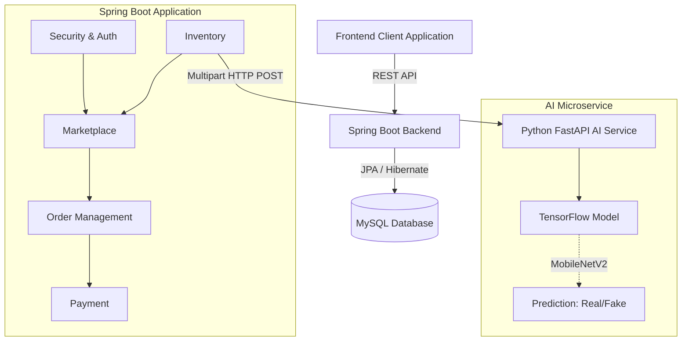
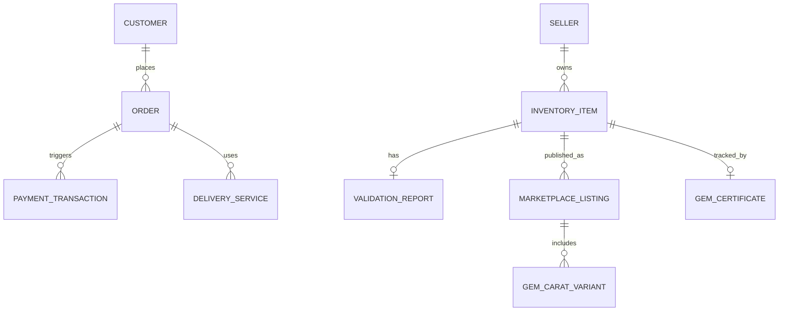

<div align="center">


# Smart Gem Marketplace
**A comprehensive enterprise-grade platform for gemstone trading and automated valuation — built with Vanilla JS, TailwindCSS, Spring Boot, Java, and AI (FastAPI/TensorFlow)**


---

*Automate gem valuations, verify authenticity with AI, discover optimal cuts, browse the marketplace, and manage secure orders & payments in one unified system.*

</div>

---

## 📖 Table of Contents
- [Overview](#-overview)
- [Team Members & Contributions](#-team-members--contributions)
- [Features](#-features)
- [Tech Stack](#-tech-stack)
- [Architecture](#-architecture)
- [Project Structure](#-project-structure)
- [Database Models](#-database-models)
- [System Screenshots](#-system-screenshots)
- [License](#-license)

---

## 🔎 Overview
**Smart Gem Marketplace** is a modular enterprise application developed as a university group project. It provides a robust backend ecosystem to streamline gemstone trading. The system handles everything from automated, AI-driven inventory appraisal and mathematical carat estimations to a fully functioning marketplace, order lifecycle management, and secure payment processing.

The project is divided into **4 core components**, independently developed by the team and seamlessly integrated using a Spring Boot architecture.

---

## 👥 Team Members & Contributions
This project was collaboratively built by a team of 4 members. Each member was responsible for a specific domain, handling the database design, business logic, and RESTful APIs for their respective component.

---

### 1️⃣ Inventory Management & AI Analysis
**👤 Chathurya** — *IT24101093*

> Core system foundation — handles gem stock, manual and automated descriptions, mathematical weight/price estimations, AI-powered authenticity detection, and certified lab gem tracking.

| Layer | Files |
|---|---|
| **Backend — Models** | `InventoryItem.java`, `GemCertificate.java`, `ValidationReport.java`, `SpecificGravity.java`, `YieldFactor.java` |
| **Backend — Services** | `InventoryItemService.java`, `CertifiedGemService.java`, `SmartAnalysisEngineService.java`, `SmartAnalysisDetectService.java` |
| **Backend — Controllers** | `InventoryItemController.java`, `CertifiedGemController.java`, `SmartAnalysisController.java` |
| **AI — Detection** | Connects to Python FastAPI via `RestTemplate` with multipart image uploads |

**Key Features Implemented:**
- 📦 **Inventory Lifecycle Management:** Track gems through statuses (In Stock, Pending, Published, Sold, Removed).
- 📜 **Certified Gems Tracking:** Directly add gems certified by recognized labs, upload lab reports, and store certificate verification URLs.
- 🧮 **Mathematical Engine (Java):** Calculates estimated carat weight and value based on volume, specific gravity, and shape factor.
- ✂️ **Smart Cut Recommendations:** Recommends the optimal gem cuts (Round, Oval, Emerald), calculating exact **yield percentages**, projected yield carats, and potential final market value after cutting.
- 🤖 **AI Gem Authenticity:** Classifies uploaded gem images (Real vs. Fake) using a custom TensorFlow MobileNetV2 model via FastAPI.

---

### 2️⃣ Marketplace Management
**👤 Jayasooriya J.M.V.** — *IT24101016*

> The storefront engine — manages listings, drafts, jewellery items, gem variants, and user-facing browse capabilities.

| Layer | Files |
|---|---|
| **Backend — Models** | `MarketplaceListing.java`, `JewelleryItem.java`, `GemCaratVariant.java` |
| **Backend — Services** | `MarketplaceService.java`, `JewelleryService.java` |
| **Backend — Controllers** | `MarketplaceController.java`, `AdminMarketplaceController.java` |

**Key Features Implemented:**
- 🏪 **Public Marketplace:** Browsing capability for loose gems and set jewellery.
- 📝 **Draft System:** Allows sellers to prepare listings before publishing.
- 💎 **Variant Management:** Handling different carats, cuts, and color tones for a single gem type.
- 🛡️ **Admin Controls:** Moderation tools for the marketplace.

---

### 3️⃣ Order Management
**👤 Dharmathilaka A.K.S** — *IT24100278*

> The logistics and order lifecycle — handles customer orders, courier configurations, insurance, and delivery tracking.

| Layer | Files |
|---|---|
| **Backend — Models** | `Order.java`, `Customer.java`, `DeliveryService.java`, `CourierShippingConfig.java` |
| **Backend — Services** | `OrderService.java`, `CustomerService.java`, `DeliveryServiceService.java` |
| **Backend — Controllers** | `OrderController.java`, `DeliveryServiceController.java`, `FinanceController.java` |

**Key Features Implemented:**
- 🛒 **Order Processing:** End-to-end processing and tracking of customer purchases.
- 🚚 **Delivery Services:** Integrations and configurations for various courier services.
- 🛡️ **Insurance & Risk:** Dynamic risk calculation for high-value gemstone shipping.
- 👥 **Customer Profiles:** Shipping detail and address management.

---

### 4️⃣ Payment Processing
**👤 Tharusha Cooray** — *IT24101462*

> The financial gateway — securely logs, verifies, and manages payment transactions for marketplace orders.

| Layer | Files |
|---|---|
| **Backend — Models** | `PaymentTransaction.java` |
| **Backend — Services** | `PaymentService.java` |
| **Backend — Controllers** | `PaymentController.java` |

**Key Features Implemented:**
- 💳 **Transaction Logging:** Securely records payment details.
- 🔄 **Lifecycle Tracking:** Monitors payment status (Pending, Success, Failed, Refunded).
- 🔗 **Order Sync:** Direct integration with the Order Management module to confirm purchases upon successful payment.
- 📊 **Analytics Dashboard:** Admin-side dashboard for tracking revenue metrics, transaction histories, and overall financial reporting.

---

## 🧠 Deep Dive: Inventory Smart Analysis

The Inventory component features a multi-layered automated appraisal and detection system.

### 🧮 1. Mathematical Engine & Cut Recommender (Java)
A custom Java service (`SmartAnalysisEngineService.java`) acts as an **Automatic Weight and Price Calculator**. Based on constants fetched from the database (Specific Gravity, Shape Factors, Yield Percents, Multipliers), it dynamically calculates exact volume, estimated carats, and fair market value.

Furthermore, it processes **Yield Percentages** to suggest the best physical cut for raw stones (Round, Oval, or Emerald) to maximize the final carat weight and financial return.

<div align="center">
  <!-- ⚠️ ACTION NEEDED: Replace the src below with your actual image path -->
  
</div>

### 🤖 2. Artificial Intelligence (Gem Authenticity)
To prevent fraud, an AI model classifies images as **Real or Fake**. 
- **Tech Stack:** FastAPI, TensorFlow, MobileNetV2
- **Supported Gems:** Ruby, Turquoise, Emerald

#### 📊 Kaggle Dataset
The model was trained on a dataset of **6,043 images**, split across Train, Test, and Validation sets.

**Source:** [Gemstones Dataset on Kaggle](https://www.kaggle.com/datasets/muhammadmuzamil5500/gemstones)

| Gem Type | Real Images (Train/Test/Val) | Fake Images (Train/Test/Val) |
| :--- | :--- | :--- |
| **Emerald** | 507 / 250 / 250 | 500 / 250 / 250 |
| **Ruby** | 500 / 250 / 250 | 536 / 250 / 250 |
| **Turquoise**| 500 / 250 / 250 | 500 / 250 / 250 |

*The model utilizes MobileNetV2 for transfer learning and achieves an accuracy of ~95%.*

#### 📓 Model Training
The AI model was trained using Google Colab. View the interactive code and training outputs here:

🔗 **https://colab.research.google.com/drive/1Tx9z7RXkURVjvaCkjNW15aUjOBXzY2jU?usp=sharing**

---

## 🛠️ Tech Stack

### Frontend (User Interface)
| Technology | Purpose |
|---|---|
| **HTML5 & CSS3** | Core structure and custom styling of the web interface |
| **JavaScript (Vanilla)** | Dynamic client-side logic and API communication |
| **TailwindCSS** | Utility-first CSS framework for modern, responsive layouts |

### Backend (REST API)
| Technology | Purpose |
|---|---|
| **Java 17** | Core programming language |
| **Spring Boot 3.x** | Application framework |
| **Spring Data JPA** | ORM and database interactions |
| **MySQL** | Relational database management |
| **Flyway** | Database schema migrations |
| **Lombok** | Boilerplate code reduction |

### AI Service (Microservice)
| Technology | Purpose |
|---|---|
| **Python** | AI logic and processing |
| **FastAPI** | High-performance API for model serving |
| **TensorFlow / Keras** | Deep learning framework (MobileNetV2) |

---

## 🏗️ Architecture



---

## 📂 Project Structure

```text
online-gem-buy-sell-system/
├── src/main/java/com/gemtrade/onlinegembuysellsystem/
│   ├── config/              # Security, CORS, Swagger configs
│   ├── common/              # Shared DTOs, Enums, Exceptions, Utils
│   ├── cart/                # Shopping cart functionality
│   ├── inventory/           # [Component 1] Inventory & Smart Analysis
│   │   ├── controller/      
│   │   ├── service/         # Contains SmartAnalysisEngine & DetectService
│   │   └── entity/          
│   ├── marketplace/         # [Component 2] Listings & Storefront
│   │   ├── controller/
│   │   ├── service/
│   │   └── entity/
│   ├── order/               # [Component 3] Orders & Shipping
│   │   ├── controller/
│   │   ├── service/
│   │   └── entity/
│   ├── payment/             # [Component 4] Transactions
│   │   ├── controller/
│   │   ├── service/
│   │   └── entity/
│   ├── seller/              # Seller profile management
│   └── reference/           # System reference data
├── src/main/resources/
│   ├── db/migration/        # Flyway SQL migrations
│   └── application.properties
└── pom.xml                  # Maven dependencies
```

---

## 🗄️ Database Models (High-Level)


---

## 📸 System Screenshots

<p align="center">
  
  
  
  
</p>

<p align="center">
  
  
  
</p>

---

## 📄 License
This project is for educational and university purposes.

---

<div align="center">
  **Built with ❤️ as a university group project.**
</div>
